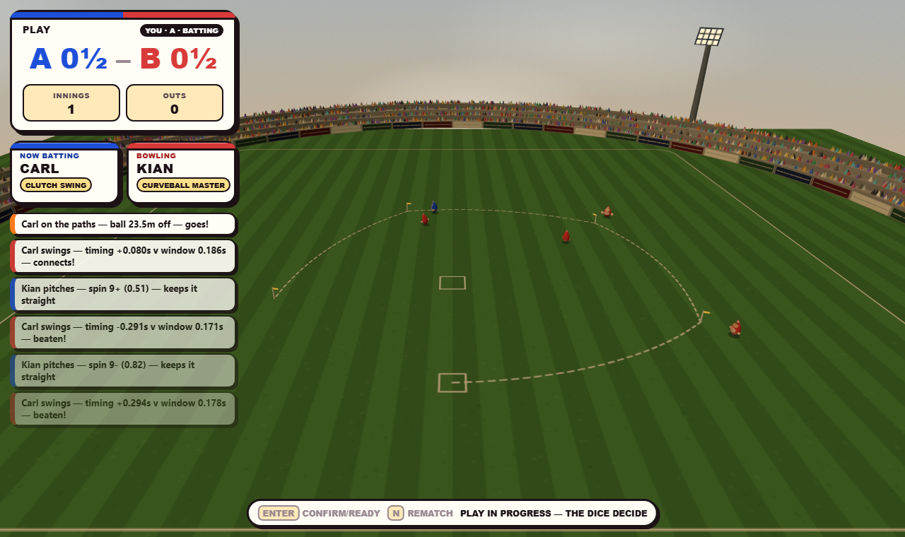
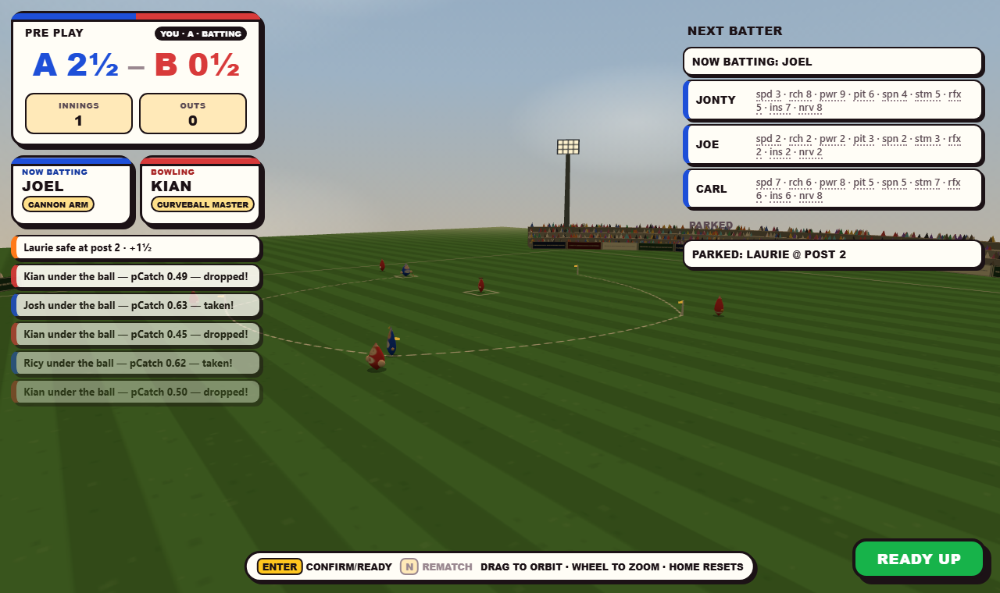
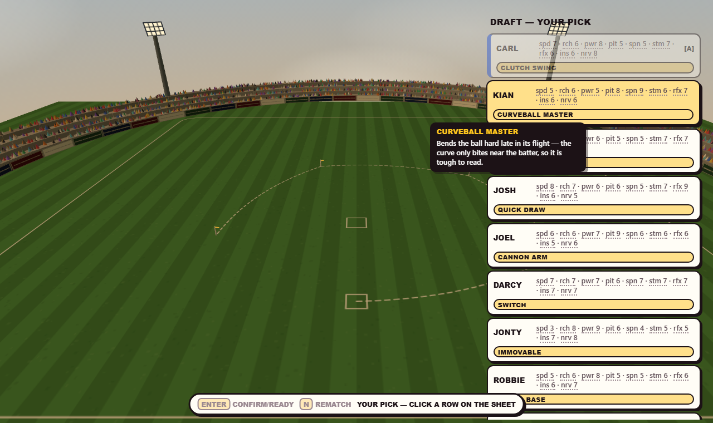
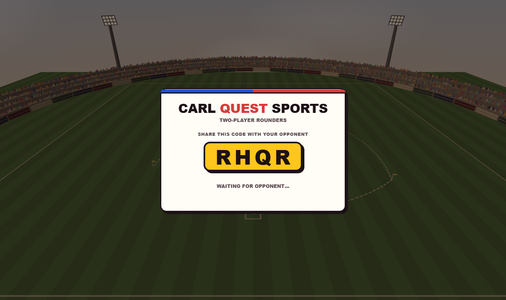

# Carl Quest Sports

A 2-player online 3D rounders game. One player creates a match and shares a
4-letter code; the other joins, you draft your squads from the shared character
pool, and manage a full game of school-rules rounders — fielder positioning,
batting order, bowler nomination, substitutions, character abilities, innings,
tiebreaks and rematches — over a server-authoritative connection. The plays
themselves resolve automatically as **visible dice rolls**: every pitch, swing,
run and catch is a stat-weighted contest that flashes up as a roll banner.

The field is a proper size and the pace is built to be *watched*: hits get
real loft instead of always being flat line drives, a hit ball can't be
caught the instant it leaves the bat, fielders relay the ball to a teammate
who's better placed rather than always lobbing it straight back, and a
resolved play holds its "how did that end" tableau for a beat before the
field resets — no more instant teleports. Each of the eleven characters is a
distinct hand-painted mascot: a rounded body with floating hands and a
painted face, not a generic capsule.

Built with **TypeScript (strict)**, **Three.js** (rendering), **Rapier**
(physics), **Colyseus** (authoritative multiplayer server) and **Vite**.

| The dice decide | The mascot lineup |
|---|---|
|  |  |

| The draft sheet | The lobby |
|---|---|
|  |  |

## Quick start (one machine, two tabs)

Requires **Node.js 20+** (npm workspaces — not pnpm).

```bash
npm install
npm run dev
```

`npm run dev` starts both halves:

- the client (Vite) at `http://localhost:5173`
- the game server (Colyseus) at `ws://localhost:2567`

Open `http://localhost:5173` in two browser tabs. In tab 1 click
**create match** and note the 4-letter code; in tab 2 enter the code and
**join**. Draft your squads by clicking character rows, then play.

## How to play

You are the **manager, not the player**: you draft the squad, set the field,
pick the batting order and nominate the bowler — then the play itself resolves
automatically as **visible dice rolls**. Every pitch, swing, run decision and
catch attempt flashes up as a roll banner (and lands on the event feed), so you
watch your decisions pay off contest by contest. The on-screen legend always
shows exactly the actions available to *you* in the current phase; a big
**READY** button (bottom-right) does the same job as `Enter` if you'd rather
click — it turns from green "READY UP" to a blue checkmark once you've
confirmed, so you always know you're waiting on your opponent, not the game.
Hover any stat, ability tag or panel row for a plain-English tooltip.

| Phase | You do |
|---|---|
| Draft | Click a character row on your turn (5 picks each) — hover a stat or ability tag for what it means |
| Positioning / pre-play | `Enter` or the READY button to confirm/ready. Fielding side: click your fielder, then click the ground to reposition (`Esc` clears); nominate your bowler and make substitutions from the panel. Batting side: click a queue row to choose the next batter — everyone not currently up walks to a bench beside the field between plays |
| Play | Hands off — the dice decide. Watch the roll banners, the ball's trail and highlight, and the bouncing icon over whoever's holding it |
| Any time | Drag to orbit the camera · mouse wheel to zoom · `Home` resets the view |
| Game over | `N` or the on-screen button to rematch |

Scoring is school rules: reach the 2nd post on your own hit for a
**half-rounder**, complete the circuit for a **rounder**; caught balls and
run-outs end the batter; five outs end the innings; ties go to sudden-death.
Every character has an ability (the bracketed tag on their draft card, with a
tooltip explaining it) that genuinely changes the dice — Kian's curveball
bends late, the Whale stops any ball that hits him dead, Jonty never drops a
catch (his rolls are guaranteed), Joe fumbles 35% of his. Each of the eleven
is a distinct hand-painted mascot to match — a rounded blob body with
floating sphere hands and a painted face/kit, no two alike: the Whale is a
huge, gentle 3.0 m giant, Joe a tiny 1.1 m worrier in an oversized shirt hem.

**The field is a full size bigger than it used to be, and plays are paced to
be watched, not blinked through**: hits get real loft (not just flat line
drives), a struck ball can't be caught in the first few metres off the bat,
fielders relay the ball to a better-placed teammate instead of always
throwing straight back to the danger post, a missed swing re-pitches quickly
rather than waiting for the ball to roll to a stop, and every resolved play
holds its final tableau for a beat before the field resets for the next one —
so you can actually see how it ended before everyone snaps back to their
spots.

## Playing over your local network (works today, no changes)

The client connects its WebSocket to whatever hostname served the page, so LAN
play needs no configuration:

1. Start the game on the host PC: `npm run dev`.
2. Find the host PC's LAN address (`ipconfig` on Windows → the IPv4 address,
   e.g. `192.168.1.42`).
3. The second player opens `http://192.168.1.42:5173` on any device on the
   same network. Their client automatically connects to
   `ws://192.168.1.42:2567`.

**Windows firewall:** the first run may prompt to allow Node.js on private
networks — allow it, or the second player's connection will hang. If there was
no prompt, add inbound rules for TCP 5173 and 2567 (private profile).

## Server hosting guide (internet play)

Three routes, in increasing order of effort. Read the
[security notes](#security-notes-before-hosting-publicly) first if strangers
could reach your server.

### Route 1 — a plain VM / VPS over HTTP (simplest real hosting)

The stock client works unchanged as long as the page is served over **plain
HTTP** and port **2567** is reachable on the **same hostname** (the client
derives its WebSocket URL from `location.hostname`).

On any Ubuntu-ish VM (or a home server with ports forwarded):

```bash
# 1. Get the code and dependencies (Node 20+)
git clone <this repo> carlquest3 && cd carlquest3
npm install                       # dev deps included — the server runs via tsx

# 2. Build the client to static files
npm run build                     # client output lands in client/dist

# 3. Run the game server (port 2567 is hardcoded in server/src/index.ts)
npx tsx server/src/index.ts       # keep it alive with pm2/systemd in practice
# e.g.  npx pm2 start "npx tsx server/src/index.ts" --name carlquest-server

# 4. Serve the built client on port 80 from the same machine
npx serve -l 80 client/dist       # or nginx / caddy serving client/dist
```

Open the firewall / cloud security group for **TCP 80 and 2567**. Players
visit `http://your-server-ip/`, and their clients connect to
`ws://your-server-ip:2567` automatically.

Two honest caveats baked into the current code (both logged in the project
log, CLAUDE.md §6.4):

- **There is no emitted server build** — `npm run build` typechecks the server
  but outputs no JS, which is why production runs through `tsx` (a TypeScript
  runner). It's a dev dependency, so install with dev deps (plain
  `npm install`, not `--omit=dev`).
- **The port is hardcoded** to `2567` in `server/src/index.ts`. Platforms that
  inject a `PORT` env variable need that one line changed
  (`listen(appConfig, Number(process.env.PORT ?? 2567))`).

### Route 2 — a PaaS (Railway / Fly.io / Render)

The server is a standard Node app, so any Node host works:

1. **Server service:** start command `npx tsx server/src/index.ts` from the
   repo root (workspaces need the root `node_modules`). Expose port 2567 — or
   make the one-line `PORT` change above if the platform assigns ports.
2. **Client:** `npm run build`, then deploy `client/dist` to any static host
   (Netlify, Cloudflare Pages, or the same PaaS).
3. **The one required code change:** hosted platforms serve over **HTTPS**,
   an HTTPS page may not open an insecure `ws://` connection (mixed content),
   and your server now lives on a *different* hostname than the client. Point
   the client at the server explicitly in `client/src/NetModule.ts`:

   ```ts
   // before (same-host, dev/LAN):
   const SERVER_URL = `ws://${location.hostname}:2567`;
   // after (hosted):
   const SERVER_URL = 'wss://your-server-app.up.railway.app';
   ```

   Use `wss://` (the platform's TLS proxy terminates it and forwards to your
   2567). Rebuild the client after the change.

### Route 3 — a quick tunnel for one evening's play

To play with one remote friend *right now*, tunnel your dev server instead of
deploying. Because the client's WebSocket URL is derived from the page's
hostname, you need the NetModule edit from Route 2 pointing at a second tunnel:

```bash
npm run dev                                   # local game as usual
# tunnel the websocket server:
cloudflared tunnel --url http://localhost:2567   # note the https://…trycloudflare.com URL
# edit client/src/NetModule.ts → SERVER_URL = 'wss://<that-url-without-https://>'
# tunnel the client:
cloudflared tunnel --url http://localhost:5173   # send THIS url to your friend
```

(ngrok works identically. Remember to revert the NetModule edit afterwards —
or better, make the URL env-driven as in Route 2.)

### Security notes before hosting publicly

These are known, logged limitations (project log §6.4) that don't matter
between friends but do on a public server:

- **Room-creation options are client-reachable.** A creating client can pass
  `seed` (predictable catch rolls), `reconnectGraceS` and `fieldSlotsOverride`
  as join options. They're runtime-validated (junk falls back to defaults) but
  not yet gated to test environments. Harden before strangers join.
- **No authentication or rate limiting** — rooms are open to anyone with the
  4-letter code (26⁴ ≈ 457k combinations; fine for friends, guessable at
  scale).
- `npm audit` has known dev-dependency advisories, triaged in the project log;
  the only runtime one (nanoid in Colyseus) doesn't apply to its usage here.

## Repository layout

- `client/` — Three.js client: rendering, input, HUD, lobby/draft/positioning UI
- `server/` — Colyseus authoritative simulation: physics, rules, all game logic
- `shared/` — types, tunable constants, stat formulas, the character roster
- `docs/design/spec.md` — the design spec (single source of intent)
- `docs/superpowers/acceptance/` — committed acceptance evidence per milestone
- `CLAUDE.md` §6 — the live project log: verified state, decisions, known issues

## Development commands

- `npm run dev` — client + server in watch mode
- `npm run check` — typecheck + lint + full test suite (all workspaces; 404
  tests — allow ~40–50 minutes: the room tests watch real-time auto-play beats
  over the readable-pacing field, which is now the single biggest cost in the
  suite; see CLAUDE.md §6.4)
- `npm run test` — Vitest only
- `npm run build` — production client build (server build wiring is a known
  open item; production uses `tsx`)

All ten build milestones from the spec are complete, each merged behind its
own tag (`m1-scaffold` … `m10-ui-polish`) with committed acceptance evidence,
followed by two post-ship overhauls (visual, then the readable-game pacing
and presentation pass covered above).
